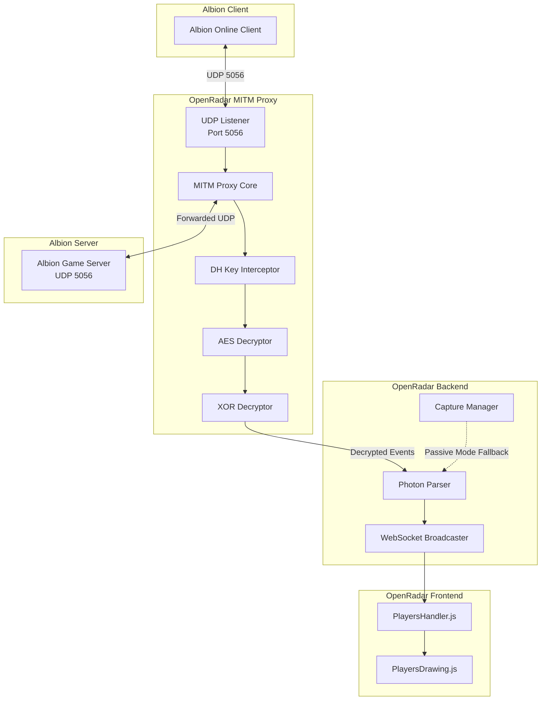
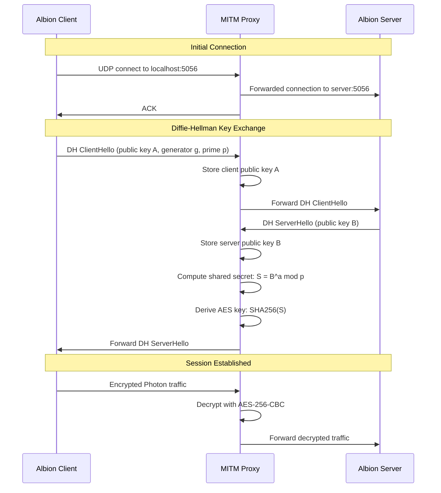
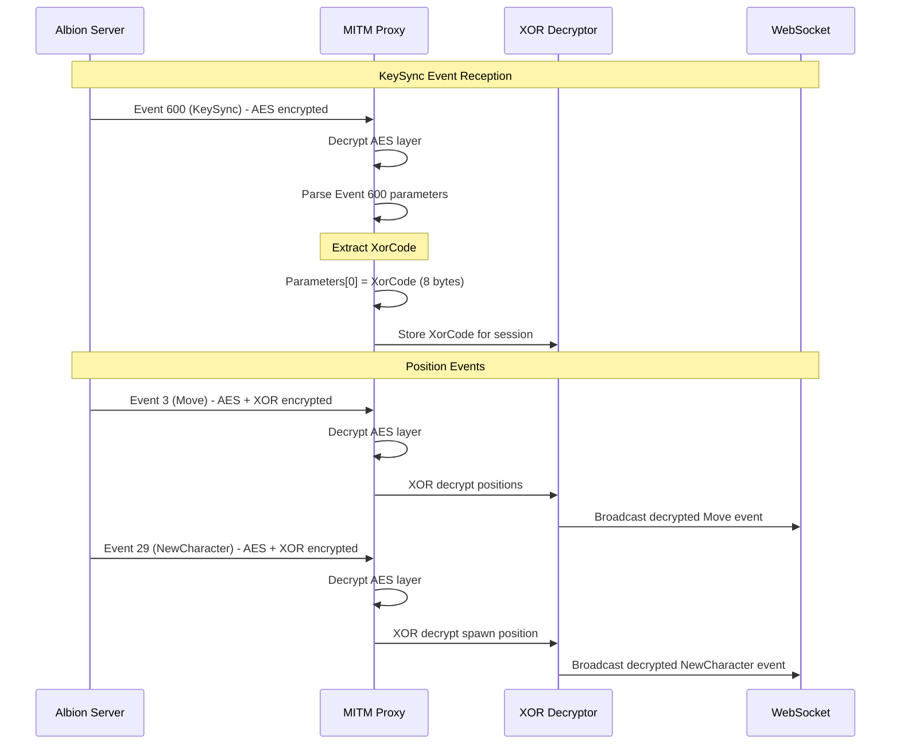
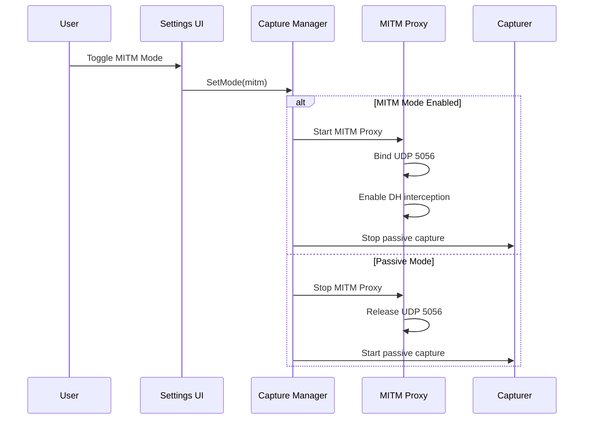

# Design Document: MITM Proxy for Player Position Decryption

## Overview

OpenRadar currently operates as a passive network capture tool that cannot display live player positions because they are encrypted with a double layer: Photon AES-256-CBC encryption on all UDP 5056 traffic, and an additional Albion XOR encryption on position coordinates. The XorCode needed for position decryption is transmitted via Event 600 (KeySync), which is itself AES-encrypted.

This design introduces a Photon Man-in-the-Middle (MITM) proxy that intercepts the Diffie-Hellman key exchange between the Albion client and server, derives the AES session key, decrypts Event 600 to extract the XorCode, and decrypts player positions in Event 3 (Move) and Event 29 (NewCharacter). The proxy integrates with the existing OpenRadar architecture while maintaining backward compatibility with passive capture mode.

## Architecture



### Component Overview

| Component | Purpose |
|-----------|---------|
| UDP Listener | Binds to port 5056, intercepts client packets |
| MITM Proxy Core | Routes packets between client and server |
| DH Key Interceptor | Captures Diffie-Hellman key exchange |
| AES Decryptor | Derives session key, decrypts Photon events |
| XOR Decryptor | Applies XorCode to decrypt position coordinates |

## Sequence Diagrams

### Connection Establishment and Key Derivation



### Event 600 KeySync Processing



### Passive vs MITM Mode Selection



## Components and Interfaces

### Component 1: MITMProxy

**Purpose**: Core proxy that intercepts and forwards UDP traffic between client and server.

**Interface**:
```go
// MITMProxy handles packet interception and forwarding
type MITMProxy struct {
    config       ProxyConfig
    conn         *net.UDPConn
    serverAddr   *net.UDPAddr
    session      *SessionState
    packetChan   chan []byte
    forwardChan  chan []byte
}

type ProxyConfig struct {
    ListenPort    int    // Default: 5056
    ServerHost    string // Albion server hostname
    ServerPort    int    // Default: 5056
    EnableAES     bool   // Enable AES decryption
    EnableXOR     bool   // Enable XOR decryption
}

func (p *MITMProxy) Start(ctx context.Context) error
func (p *MITMProxy) Stop() error
func (p *MITMProxy) OnPacket(handler PacketHandler)
```

**Responsibilities**:
- Listen on UDP 5056 for client connections
- Forward packets to actual Albion server
- Route decrypted events to existing WebSocket handler
- Manage session state and key lifecycle

### Component 2: DHKeyInterceptor

**Purpose**: Captures and processes Diffie-Hellman key exchange to derive session key.

**Interface**:
```go
// DHKeyInterceptor handles Diffie-Hellman key exchange interception
type DHKeyInterceptor struct {
    prime      *big.Int  // Oakley 768-bit prime
    generator  *big.Int  // Generator: 22
    clientPub  *big.Int  // Client public key A
    serverPub  *big.Int  // Server public key B
    sharedKey  *big.Int  // Shared secret S = B^a mod p
    aesKey     []byte    // SHA256(sharedKey)
}

func (d *DHKeyInterceptor) ProcessClientHello(data []byte) error
func (d *DHKeyInterceptor) ProcessServerHello(data []byte) error
func (d *DHKeyInterceptor) DeriveAESKey() ([]byte, error)
func (d *DHKeyInterceptor) GetSessionKey() []byte
```

**DH Parameters**:
- Prime (p): Oakley 768-bit MODP group
- Generator (g): 22
- Client sends: A = g^a mod p
- Server sends: B = g^b mod p
- Shared secret: S = B^a mod p = A^b mod p
- AES key: SHA256(S)

**Responsibilities**:
- Identify DH handshake packets
- Extract public keys from handshake
- Compute shared secret
- Derive AES-256 session key

### Component 3: AESDecryptor

**Purpose**: Decrypts Photon AES-256-CBC encrypted events.

**Interface**:
```go
// AESDecryptor handles AES-256-CBC decryption of Photon traffic
type AESDecryptor struct {
    key       []byte  // 32-byte AES key
    iv        []byte  // 16 null bytes
    cipher    cipher.Block
    enabled   bool
}

func (a *AESDecryptor) SetKey(key []byte) error
func (a *AESDecryptor) Decrypt(data []byte) ([]byte, error)
func (a *AESDecryptor) DecryptEvent(event *EventData) (*EventData, error)
```

**Encryption Details**:
- Algorithm: AES-256-CBC
- IV: 16 null bytes (0x00 * 16)
- Key: SHA256 of DH shared secret (32 bytes)
- Applied to all Photon events after DH handshake

**Responsibilities**:
- Initialize cipher with derived key
- Decrypt Photon event payloads
- Handle CBC padding

### Component 4: XORDecryptor

**Purpose**: Decrypts XOR-encrypted player position coordinates.

**Interface**:
```go
// XORDecryptor handles XOR decryption of position coordinates
type XORDecryptor struct {
    xorCode   []byte  // 8-byte XorCode from Event 600
    enabled   bool
}

func (x *XORDecryptor) SetXorCode(code []byte)
func (x *XORDecryptor) DecryptFloat(encrypted []byte) float32
func (x *XORDecryptor) DecryptPosition(event *EventData) (*EventData, error)
func (x *XORDecryptor) ExtractXorCodeFromEvent600(event *EventData) ([]byte, error)
```

**XOR Algorithm**:
```go
// DecryptFloat XOR-decrypts 4 bytes into a float32
func (x *XORDecryptor) DecryptFloat(encrypted []byte) float32 {
    decrypted := make([]byte, 4)
    for i := 0; i < 4; i++ {
        decrypted[i] = encrypted[i] ^ x.xorCode[i]
    }
    return math.Float32frombits(binary.LittleEndian.Uint32(decrypted))
}
```

**Responsibilities**:
- Store XorCode from Event 600
- Decrypt position X coordinate (bytes 0-3)
- Decrypt position Y coordinate (bytes 4-7)
- Handle relative vs absolute position conversion

### Component 5: SessionState

**Purpose**: Maintains session state including keys and connection info.

**Interface**:
```go
// SessionState tracks the current MITM session state
type SessionState struct {
    mu            sync.RWMutex
    sessionID     string
    clientAddr    *net.UDPAddr
    serverAddr    *net.UDPAddr
    aesKey        []byte
    xorCode       []byte
    connectedAt   time.Time
    lastActivity  time.Time
    stats         SessionStats
}

type SessionStats struct {
    PacketsIntercepted int64
    PacketsForwarded   int64
    EventsDecrypted    int64
    PositionsDecrypted int64
}

func (s *SessionState) SetAESKey(key []byte)
func (s *SessionState) SetXorCode(code []byte)
func (s *SessionState) GetXorCode() []byte
func (s *SessionState) Reset()
```

**Responsibilities**:
- Track session lifecycle
- Store encryption keys securely
- Provide thread-safe key access
- Track decryption statistics

## Data Models

### Model 1: Event600KeySync

```go
// Event600KeySync represents the decrypted KeySync event
type Event600KeySync struct {
    XorCode    []byte  `json:"xorCode"`    // 8 bytes, Parameters[0]
    Timestamp  int64   `json:"timestamp"`
    SequenceID int     `json:"sequenceId"`
}
```

**Validation Rules**:
- XorCode must be exactly 8 bytes
- Event must arrive after DH handshake completes
- XorCode changes on zone transitions

### Model 2: DecryptedPosition

```go
// DecryptedPosition represents a decrypted player position
type DecryptedPosition struct {
    ID         int64   `json:"id"`         // Entity ID from event
    X          float32 `json:"x"`          // Decrypted X coordinate
    Y          float32 `json:"y"`          // Decrypted Y coordinate
    RelativeX  float32 `json:"relativeX"`  // Relative to local player
    RelativeY  float32 `json:"relativeY"`  // Relative to local player
    Timestamp  int64   `json:"timestamp"`
    EventType  byte    `json:"eventType"`  // 3=Move, 29=NewCharacter
}
```

**Validation Rules**:
- X and Y must be finite (not NaN/Inf)
- Coordinates are relative to cluster origin
- Must match entity ID from spawn event

### Model 3: MITMConfig

```go
// MITMConfig stores user-configurable MITM settings
type MITMConfig struct {
    Enabled          bool   `json:"enabled"`
    ListenPort       int    `json:"listenPort"`
    ServerOverride   string `json:"serverOverride"` // Optional: custom server
    AutoRestart      bool   `json:"autoRestart"`
    LogDecrypted     bool   `json:"logDecrypted"`
    WarnTOSRisk      bool   `json:"warnTOSRisk"`    // Show TOS warning
}
```

**Validation Rules**:
- ListenPort must be available
- ServerOverride must be valid hostname
- WarnTOSRisk defaults to true

## Algorithmic Pseudocode

### Main Processing Algorithm

```go
// ProcessPacket handles an intercepted UDP packet
// INPUT: packet of type []byte
// OUTPUT: error or nil
// PRECONDITION: proxy is started, connection is established
// POSTCONDITION: packet is decrypted if applicable and forwarded
func (p *MITMProxy) ProcessPacket(packet []byte) error {
    // Step 1: Parse packet header
    header, err := ParsePhotonHeader(packet)
    if err != nil {
        return fmt.Errorf("invalid packet: %w", err)
    }
    
    // Step 2: Check if DH handshake phase
    if p.session.GetState() == StateHandshake {
        if err := p.dhInterceptor.Process(packet); err != nil {
            return fmt.Errorf("DH error: %w", err)
        }
        // Forward unmodified during handshake
        p.forwardPacket(packet)
        return nil
    }
    
    // Step 3: Decrypt AES layer
    decrypted, err := p.aesDecryptor.Decrypt(packet)
    if err != nil {
        // Forward encrypted if decryption fails
        p.forwardPacket(packet)
        return nil
    }
    
    // Step 4: Parse decrypted event
    event, err := photon.DeserializeEvent(decrypted)
    if err != nil {
        p.forwardPacket(packet)
        return nil
    }
    
    // Step 5: Handle special events
    switch event.Code {
    case eventcodes.KeySync:
        xorCode := p.xorDecryptor.ExtractXorCode(event)
        p.session.SetXorCode(xorCode)
        p.logger.Info("KeySync received", "xorCode", xorCode)
        
    case eventcodes.Move, eventcodes.NewCharacter:
        if p.session.GetXorCode() != nil {
            decrypted := p.xorDecryptor.DecryptPosition(event)
            p.broadcastEvent(decrypted)
        }
    }
    
    // Step 6: Forward to server
    p.forwardPacket(packet)
    return nil
}
```

**Preconditions**:
- Proxy is started and listening
- UDP connection is established
- Packet is valid Photon protocol

**Postconditions**:
- Packet is forwarded to destination
- Events are decrypted if applicable
- No packet loss occurs

**Loop Invariants**:
- Session state remains consistent
- Forwarding continues regardless of decryption errors

### Diffie-Hellman Key Derivation Algorithm

```go
// DeriveAESKey computes the AES session key from DH exchange
// INPUT: none (uses stored public keys)
// OUTPUT: 32-byte AES key
// PRECONDITION: client and server public keys are set
// POSTCONDITION: returned key is SHA256 of shared secret
func (d *DHKeyInterceptor) DeriveAESKey() ([]byte, error) {
    // ASSERT: d.clientPub and d.serverPub are set
    if d.clientPub == nil || d.serverPub == nil {
        return nil, errors.New("missing public keys")
    }
    
    // Step 1: Compute shared secret
    // S = serverPub^clientPrivate mod prime
    // (We use client's stored private exponent)
    sharedSecret := new(big.Int).Exp(
        d.serverPub,           // base
        d.clientPrivate,       // exponent
        d.prime,               // modulus
    )
    
    // Step 2: Convert to bytes
    secretBytes := sharedSecret.Bytes()
    
    // Step 3: Derive AES key via SHA256
    hash := sha256.Sum256(secretBytes)
    
    // ASSERT: hash is 32 bytes
    d.aesKey = hash[:]
    
    return d.aesKey, nil
}
```

**Preconditions**:
- Client public key A received
- Server public key B received
- Client private exponent stored

**Postconditions**:
- AES key is valid 32-byte key
- Key matches server's derived key

### Position XOR Decryption Algorithm

```go
// DecryptPosition extracts and decrypts position from Move/NewCharacter event
// INPUT: event of type *EventData
// OUTPUT: decrypted event with position parameters
// PRECONDITION: xorCode is set (8 bytes)
// POSTCONDITION: Parameters[4] and Parameters[5] contain valid floats
func (x *XORDecryptor) DecryptPosition(event *EventData) *EventData {
    // ASSERT: x.xorCode is 8 bytes
    if len(x.xorCode) != 8 {
        return event // No decryption possible
    }
    
    // Extract encrypted position bytes from Parameters[1]
    raw, ok := event.Parameters[1].(photon.ByteArray)
    if !ok || len(raw) < 17 {
        return event // Invalid position data
    }
    
    // Decrypt X coordinate (bytes 9-12)
    encryptedX := raw[9:13]
    decryptedX := make([]byte, 4)
    for i := 0; i < 4; i++ {
        decryptedX[i] = encryptedX[i] ^ x.xorCode[i]
    }
    xCoord := math.Float32frombits(binary.LittleEndian.Uint32(decryptedX))
    
    // Decrypt Y coordinate (bytes 13-16)
    encryptedY := raw[13:17]
    decryptedY := make([]byte, 4)
    for i := 0; i < 4; i++ {
        decryptedY[i] = encryptedY[i] ^ x.xorCode[i+4]
    }
    yCoord := math.Float32frombits(binary.LittleEndian.Uint32(decryptedY))
    
    // Validate decrypted coordinates
    if !isFiniteFloat32(xCoord) || !isFiniteFloat32(yCoord) {
        return event // Decryption failed, return original
    }
    
    // Inject decrypted positions
    event.Parameters[4] = xCoord
    event.Parameters[5] = yCoord
    
    return event
}
```

**Preconditions**:
- XorCode is 8 bytes from Event 600
- Event contains ByteArray at Parameters[1]
- ByteArray is at least 17 bytes

**Postconditions**:
- Parameters[4] contains valid X coordinate
- Parameters[5] contains valid Y coordinate
- Original event is preserved if decryption fails

**Loop Invariants**:
- XOR operation is deterministic
- Same XorCode always produces same result

### KeySync Event Processing Algorithm

```go
// ExtractXorCode extracts the 8-byte XorCode from Event 600
// INPUT: event of type *EventData
// OUTPUT: 8-byte XorCode
// PRECONDITION: event.Code == 600 (KeySync)
// POSTCONDITION: returned slice is exactly 8 bytes
func (x *XORDecryptor) ExtractXorCodeFromEvent600(event *EventData) ([]byte, error) {
    // ASSERT: event is Event 600
    if event.Code != eventcodes.KeySync {
        return nil, errors.New("not KeySync event")
    }
    
    // XorCode is in Parameters[0] as ByteArray
    xorCode, ok := event.Parameters[0].(photon.ByteArray)
    if !ok {
        return nil, errors.New("XorCode not found in Parameters[0]")
    }
    
    // ASSERT: XorCode is exactly 8 bytes
    if len(xorCode) != 8 {
        return nil, fmt.Errorf("invalid XorCode length: %d", len(xorCode))
    }
    
    // Store and return
    x.xorCode = xorCode
    return xorCode, nil
}
```

**Preconditions**:
- Event is decrypted (AES layer removed)
- Event code is 600

**Postconditions**:
- XorCode is stored in XORDecryptor
- Future position events can be decrypted

## Key Functions with Formal Specifications

### Function 1: Start()

```go
func (p *MITMProxy) Start(ctx context.Context) error
```

**Preconditions:**
- `p.config.ListenPort` is available (not in use)
- `p.config.ServerHost` is resolvable
- Network is reachable

**Postconditions:**
- UDP listener is bound to configured port
- Forwarding goroutine is running
- Proxy is ready to intercept packets
- Returns `nil` on success, error on failure

**Loop Invariants:**
- Packet forwarding continues until context is cancelled
- Each packet is processed exactly once

### Function 2: DeriveAESKey()

```go
func (d *DHKeyInterceptor) DeriveAESKey() ([]byte, error)
```

**Preconditions:**
- `d.clientPub` is set (received from client)
- `d.serverPub` is set (received from server)
- `d.clientPrivate` is stored from handshake
- `d.prime` and `d.generator` are initialized

**Postconditions:**
- Returns 32-byte AES key derived from SHA256 of shared secret
- Key matches the server's derived key
- Returns error if keys are missing

**Loop Invariants:** N/A

### Function 3: DecryptPosition()

```go
func (x *XORDecryptor) DecryptPosition(event *EventData) *EventData
```

**Preconditions:**
- `x.xorCode` is set and exactly 8 bytes
- `event.Parameters[1]` exists and is ByteArray
- ByteArray length >= 17 bytes

**Postconditions:**
- `event.Parameters[4]` contains decrypted X coordinate (float32)
- `event.Parameters[5]` contains decrypted Y coordinate (float32)
- Coordinates are finite (not NaN/Inf)
- Original event preserved if decryption fails

**Loop Invariants:**
- XOR decryption is deterministic for same XorCode

### Function 4: ExtractXorCodeFromEvent600()

```go
func (x *XORDecryptor) ExtractXorCodeFromEvent600(event *EventData) ([]byte, error)
```

**Preconditions:**
- `event` is not nil
- `event.Code` equals `eventcodes.KeySync` (600)
- Event is AES-decrypted

**Postconditions:**
- Returns 8-byte XorCode from `Parameters[0]`
- XorCode is stored for future position decryption
- Returns error if XorCode not found or invalid length

**Loop Invariants:** N/A

## Example Usage

```go
// Example 1: Starting the MITM proxy
func main() {
    ctx := context.Background()
    
    config := MITMConfig{
        Enabled:       true,
        ListenPort:    5056,
        AutoRestart:   true,
        WarnTOSRisk:   true,
    }
    
    proxy := NewMITMProxy(config)
    
    // Handle decrypted events
    proxy.OnPacket(func(event *photon.EventData) {
        switch event.Code {
        case eventcodes.Move:
            x := event.Parameters[4].(float32)
            y := event.Parameters[5].(float32)
            fmt.Printf("Player moved to (%.2f, %.2f)\n", x, y)
        case eventcodes.NewCharacter:
            name := event.Parameters[1].(string)
            x := event.Parameters[4].(float32)
            y := event.Parameters[5].(float32)
            fmt.Printf("Player %s spawned at (%.2f, %.2f)\n", name, x, y)
        }
    })
    
    if err := proxy.Start(ctx); err != nil {
        log.Fatalf("Failed to start proxy: %v", err)
    }
    defer proxy.Stop()
    
    <-ctx.Done()
}

// Example 2: Mode selection in settings
func (m *CaptureManager) SetMode(mode CaptureMode) error {
    if mode == ModeMITM {
        // Stop passive capture
        m.StopPassiveCapture()
        
        // Start MITM proxy
        if err := m.proxy.Start(m.ctx); err != nil {
            // Fallback to passive on failure
            m.StartPassiveCapture()
            return err
        }
    } else {
        // Stop MITM proxy
        m.proxy.Stop()
        
        // Start passive capture
        m.StartPassiveCapture()
    }
    return nil
}

// Example 3: Event 600 handling
func (h *EventHandler) HandleEvent600(event *photon.EventData) {
    xorCode, err := h.xorDecryptor.ExtractXorCodeFromEvent600(event)
    if err != nil {
        h.logger.Warn("Failed to extract XorCode", "error", err)
        return
    }
    
    h.session.SetXorCode(xorCode)
    h.logger.Info("XorCode updated", "xorCode", fmt.Sprintf("%x", xorCode))
}
```

## Correctness Properties

*A property is a characteristic or behavior that should hold true across all valid executions of a system-essentially, a formal statement about what the system should do. Properties serve as the bridge between human-readable specifications and machine-verifiable correctness guarantees.*

### Property 1: Client Packet Forwarding

*For any* UDP packet received from the Albion client, the MITM proxy SHALL forward the packet to the configured Albion server address (live.albiononline.com:5056).

**Validates: Requirements 1.2**

### Property 2: Server Packet Forwarding

*For any* UDP packet received from the Albion server, the MITM proxy SHALL forward the packet to the connected Albion client address.

**Validates: Requirements 1.3**

### Property 3: DH ClientHello Detection

*For any* valid DH ClientHello packet initiating a Photon connection, the DH interceptor SHALL detect and flag the packet as a handshake initiation.

**Validates: Requirements 2.1**

### Property 4: DH Response Parameters

*For any* valid DH initiation packet, the MITM proxy SHALL respond using Oakley 768-bit MODP group with generator 22.

**Validates: Requirements 2.2**

### Property 5: DH Shared Secret Computation

*For any* valid DH key pair (client public A, server public B, client private exponent a), the computed shared secret SHALL equal B^a mod p using the Oakley 768-bit prime.

**Validates: Requirements 2.3**

### Property 6: AES Key Derivation

*For any* shared secret S, the derived AES key SHALL equal SHA256(S) and be exactly 32 bytes.

**Validates: Requirements 2.4**

### Property 7: AES Round-Trip Preservation

*For any* Photon event data, encrypting with the derived AES key and then decrypting with the same key SHALL produce the original event data.

**Validates: Requirements 3.1, 3.2**

### Property 8: Event Parameter Parsing

*For any* valid decrypted Photon event bytes, the deserializer SHALL extract the event code and all parameter key-value pairs.

**Validates: Requirements 3.2**

### Property 9: XorCode Extraction

*For any* valid Event 600 (KeySync) with XorCode in Parameters[0], the XOR decryptor SHALL extract exactly 8 bytes.

**Validates: Requirements 4.1**

### Property 10: XorCode Update

*For any* sequence of Event 600 values arriving over time, the stored XorCode SHALL always equal the most recently received valid XorCode.

**Validates: Requirements 4.3**

### Property 11: X Coordinate Decryption

*For any* 4-byte encrypted X coordinate and XorCode, the decryption SHALL equal the byte-wise XOR of encrypted bytes with XorCode bytes 0-3, interpreted as little-endian float32.

**Validates: Requirements 5.1, 5.4, 5.5**

### Property 12: Y Coordinate Decryption

*For any* 4-byte encrypted Y coordinate and XorCode, the decryption SHALL equal the byte-wise XOR of encrypted bytes with XorCode bytes 4-7, interpreted as little-endian float32.

**Validates: Requirements 5.2, 5.4, 5.5**

### Property 13: Spawn Position Decryption

*For any* Event 29 (NewCharacter) with encrypted spawn position, the XOR decryptor SHALL decrypt the coordinates using the stored XorCode and inject them into Parameters[4] (X) and Parameters[5] (Y).

**Validates: Requirements 5.3**

### Property 14: XOR Round-Trip

*For any* byte value b and XorCode byte k, applying XOR decryption twice SHALL return the original value: (b XOR k) XOR k = b.

**Validates: Requirements 5.4**

### Property 15: Packet Content Preservation

*For any* packet forwarded by the MITM proxy, the forwarded content SHALL equal either the original packet or the properly decrypted packet content.

**Validates: Requirements 10.2**

### Property 16: Localhost Binding

*For any* MITM proxy startup, the UDP listener SHALL bind only to localhost (127.0.0.1) and not to external network interfaces.

**Validates: Requirements 10.1**

## Error Handling

### Error Scenario 1: Port Binding Failure

**Condition**: UDP port 5056 is already in use by another process
**Response**: Log error, display user-friendly message, suggest closing conflicting application
**Recovery**: Retry with alternative port or wait for port release

### Error Scenario 2: DH Handshake Timeout

**Condition**: Diffie-Hellman handshake does not complete within timeout period
**Response**: Reset session, log warning, restart handshake listener
**Recovery**: User must reconnect to trigger new handshake

### Error Scenario 3: AES Decryption Failure

**Condition**: Packet cannot be decrypted with derived AES key
**Response**: Forward encrypted packet, log debug message, increment error counter
**Recovery**: Continue forwarding; wait for next session/key sync

### Error Scenario 4: XorCode Missing

**Condition**: Position event received before Event 600 KeySync
**Response**: Log warning, forward encrypted event, skip position extraction
**Recovery**: Positions will decrypt after KeySync arrives

### Error Scenario 5: Server Connection Lost

**Condition**: Connection to Albion server is interrupted
**Response**: Clean up session, notify frontend, enter reconnect state
**Recovery**: Auto-reconnect if AutoRestart enabled, else wait for manual restart

### Error Scenario 6: Invalid XorCode Length

**Condition**: Event 600 contains XorCode that is not exactly 8 bytes
**Response**: Log error, skip XorCode storage, continue forwarding
**Recovery**: Wait for next KeySync event

## Testing Strategy

### Test Type Classification Summary

Based on acceptance criteria analysis, tests are classified as follows:

| Test Type | Count | Examples |
|-----------|-------|----------|
| PROPERTY | 16 | Packet forwarding, DH computation, AES/XOR decryption |
| EXAMPLE | 14 | Error handling, mode switching, cleanup behavior |
| EDGE_CASE | 3 | Corrupted packets, missing XorCode, invalid Event 600 |
| INTEGRATION | 12 | Performance, timing, UI, end-to-end flows |
| SMOKE | 3 | Port binding, localhost verification, data security |

### Unit Testing Approach

Unit tests will verify individual component behavior with specific examples:

- **DHKeyInterceptor**: Test key derivation with known inputs and expected outputs
- **AESDecryptor**: Test decryption with known AES-256-CBC ciphertext
- **XORDecryptor**: Test position decryption with known XorCode and encrypted values
- **SessionState**: Test concurrent key access, state transitions

Coverage goal: 80%+ on all crypto components

### Property-Based Testing Approach

Property-based tests will validate universal correctness properties using Go's `testing/quick` or `gopter` library:

**Configuration**: Minimum 100 iterations per property test

**Property Test Cases**:

| Property | Test Strategy |
|----------|---------------|
| Client Packet Forwarding | Generate random UDP packets, verify forwarding to server address |
| Server Packet Forwarding | Generate random UDP packets, verify forwarding to client address |
| DH ClientHello Detection | Generate valid DH initiation packets, verify detection flag |
| DH Shared Secret | Generate random DH key pairs, verify B^a mod p computation |
| AES Key Derivation | Generate random shared secrets, verify SHA256 output is 32 bytes |
| AES Round-Trip | Generate random event data, verify encrypt→decrypt returns original |
| XorCode Extraction | Generate valid Event 600 with random 8-byte values, verify extraction |
| XorCode Update | Generate sequence of Event 600 values, verify latest is stored |
| X Coordinate Decryption | Generate random encrypted bytes and XorCode, verify XOR math |
| Y Coordinate Decryption | Generate random encrypted bytes and XorCode, verify XOR math |
| XOR Round-Trip | For any byte b and XorCode k, verify (b XOR k) XOR k = b |

### Edge Case Testing

Edge case tests verify graceful handling of boundary conditions:

- **Corrupted Packet Data**: AES decryption skips event, processing continues
- **Missing XorCode**: Position decryption skipped, position marked as encrypted
- **Invalid XorCode Length**: Event 600 with wrong length, previous XorCode retained
- **Malformed Event 600**: Invalid parameters, warning logged

### Integration Testing Approach

Integration tests verify end-to-end flows and external dependencies:

- **DH → AES → XOR Flow**: Complete key derivation and decryption pipeline
- **WebSocket Integration**: Verify decrypted events reach frontend
- **Mode Switching**: Test passive ↔ MITM mode transitions
- **Error Recovery**: Simulate failures and verify fallback behavior
- **Performance Benchmarks**: Latency (<10ms), throughput (500+ events/sec), memory (<100MB)

### Smoke Testing

Smoke tests verify infrastructure setup:

- **Port Binding**: UDP listener binds to port 5056 on startup
- **Localhost Binding**: Listener binds only to 127.0.0.1
- **No Plain-Text Logging**: Verify decrypted data not written to disk

### Test Tags

Each test must be tagged with feature and property reference:

```go
// Feature: mitm-proxy-player-positions, Property 7: AES Round-Trip Preservation
func TestAESRoundTrip(t *testing.T) {
    // ...
}
```

## Performance Considerations

### Latency Requirements

- Packet forwarding latency: < 1ms per packet
- Decryption overhead: < 0.5ms per event
- Total additional latency: < 2ms (acceptable for real-time gameplay)

### Throughput Requirements

- Handle up to 1000 packets/second during intense gameplay
- Decrypt up to 500 events/second
- WebSocket broadcast: up to 100 events/second to frontend

### Optimization Strategies

- Use sync.Pool for byte buffer reuse
- Pre-allocate decryption buffers
- Parallel event processing for bulk Move events
- Cache parsed Photon headers

## Security Considerations

### Increased Detection Risk

The MITM proxy modifies the network path between client and server, which increases detection risk compared to passive capture:

1. **Traffic Analysis**: Server sees connection from proxy IP, not client IP
2. **Timing Analysis**: Additional latency may be detectable
3. **Behavioral Analysis**: Proxy behavior may differ from normal client

### Mitigation Strategies

- Document TOS implications clearly in UI
- Warn users before enabling MITM mode
- Keep latency minimal to avoid timing detection
- Consider adding random jitter to packet forwarding

### Data Security

- Clear AES keys from memory on session end
- Never log raw encryption keys
- Secure XorCode storage (memory only, no disk)

## Dependencies

### Go Standard Library

- `crypto/aes`: AES-256-CBC implementation
- `crypto/cipher`: CBC mode
- `crypto/sha256`: Key derivation
- `math/big`: Diffie-Hellman arithmetic
- `net`: UDP networking

### Existing OpenRadar Packages

- `internal/photon`: Event deserialization and parsing
- `internal/capture`: Network capture interface
- `internal/server`: WebSocket broadcasting

### External Dependencies

- `github.com/google/gopacket`: Packet capture and parsing (already used)
- DH Oakley 768-bit prime constants (hardcoded)
